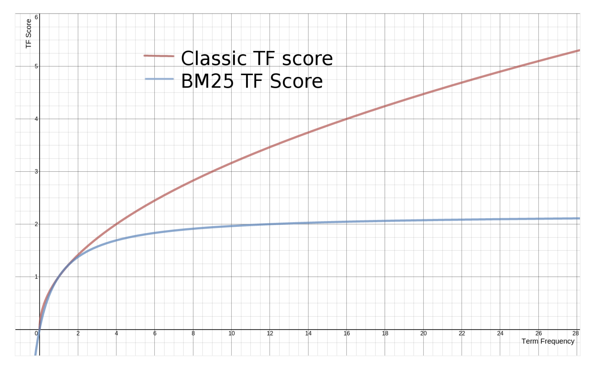
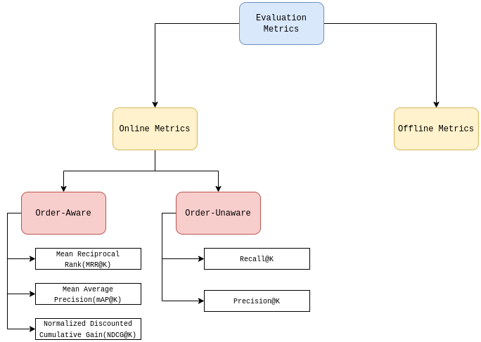

## Traditional Similarity Search

Traditional techniques, such as Jaccard similarity, w-shingling, and Levenshtein distance, excel in tasks like syntax checking and word spelling checking. However, when it comes to similarity search in natural language, they often face challenges. To overcome these limitations, modern approaches leverage dense embeddings (vectors) and other advanced methods for more effective similarity search. 

**Some of traditional techniques are**:
1. **Jaccard Similarity**: This is a measure of similarity between two sets. It's calculated by dividing the size of the intersection of the sets by the size of the union of the sets. In the context of text analysis, it's often used for comparing documents or strings(word).
$$
Jaccard = \frac{intersection(A, B)}{union(A, B)}
$$

```python
def jaccard(str_a: str, str_b: str):
    # convert to sets
    X = set(str_a.split())
    Y = set(set_b.split())
    # calculate interse3ction and union
    intersection = X.interaction(y)
    union = X.union(y)
    return len(intersection) / len(union)
```

2. **w-shingling**: Shingling is a technique used in text analysis where contiguous subsequences of words (or characters) are formed. "w" in w-shingling refers to the width of the shingle, i.e., the number of words (or characters) in each subsequence(in simple term, **compare n-gram**). This technique is used to detect similarity between documents based on overlapping shingles.

```python
# for bigram change above X(also change Y same way) as:
X = set([' '.join([a[i], a[i+1]]) for i in range(len(a)-1)])
```


3. **Levenshtein Distance**: This is a measure of the difference between two sequences, typically strings, and is defined as the minimum number of single-character edits (insertions, deletions, or substitutions) required to change one string into the other. It's often used in spell checking, DNA analysis, and other fields where the difference between sequences needs to be quantified.
particularly in situations where approximate matching is required.

The Levenshtein Distance between two strings, often denoted as $\text{lev}(a, b)$ where $a$ and $b$ are the strings to be compared, can be recursively defined by the following equation:

$$
\text{lev}(a, b) = 
\begin{cases} 
\max(i, j) & \text{if } \min(i, j) = 0 \\
1_{(a_i\neq b_i)} + \min\left\{
\begin{array}{ll}
\text{lev}(i-1, j) \\
\text{lev}(i, j-1)  & \quad \text{else } \\
\text{lev}(i-1, j-1) 
\end{array}
\right.
\end{cases}
$$

This recursive equation essentially states that the Levenshtein Distance between two strings $a$ and $b$ is equal to:
- The length of the longer string if one of the strings is empty.
- Otherwise, it's the minimum of three values:
  - The distance of the two strings with their first characters removed plus one if the first characters are different.
  - The distance of the two strings with their first characters removed if the first characters are the same.

This equation serves as the foundation for dynamic programming algorithms used to efficiently compute the Levenshtein Distance.

```python
def levenshtein(a: str, b: str):
    # we must add an additional character at the start of each string
    a = f" {a}"
    b = f" {b}"
    # initialize the empty zero array
    lev = np.zeros((len(a), len(b)))
    # now iterate through each value, finding best path
    for i in  range(len(a)):
        for j in range(len(b)):
            if min([i, j]) == 0:
                lev[i, j] = max([i, j])
            else:
                # calculate three possivle outcome
                x = lev[i-1, j] # deletion
                y = lev[i, j-1] # insertion
                z = lev[i-1, j-1] # substitution
                # take the minimum (best operation/path)
                lev[i, j] = min(x, y, z)
                # and if our two current characters donot match, add 1
                if a[i] != b[j]:
                    lev[i, j] += 1
    # lLevenshtein disstance matrix and number of operation  need to be performed to make a=b(last element of matrix)
    return lev, lev[-1, -1]
```
## Vector-based Methods for Similarity Search

TF-IDF, BM25, and SBERT are commonly used vector-based methods for similarity search, with TF-IDF and BM25 being sparse vector similarity search methods, while SBERT utilizes dense vectors.

1. **TF-IDF (Term-Frequency-Inverse Document Frequency)**:
   - TF-IDF calculates the importance of a term in a document relative to a collection of documents.
   - **TF (Term Frequency)**: It measures how often a term appears in a document relative to the total number of terms in that document. It's calculated using the formula:
     $$
     \text{TF} = \frac{f(q, D)}{f(t, D)}
     $$
     where $f(q, D)$ represents the frequency of the query term $q$ in all documents $D$, and $f(t, D)$ represents the frequency of all terms in the document $D$.
   - **IDF (Inverse Document Frequency)**: It measures the importance of a term across a collection of documents. It's calculated using the formula:
     $$
     \text{IDF} = \log \frac{N}{N(q)}
     $$
     where $N$ is the total number of documents being searched and $N(q)$ is the number of documents in which the query term appears.
   - TF-IDF is obtained by multiplying TF with IDF. It gives higher scores to terms that are rare across the entire document collection, thus emphasizing the importance of rare terms in the query.
   $$
   \text{TF-IDF} = \frac{f(q, D)}{f(t, D)} * \log \left(\frac{N}{N(q)}\right)
   $$
```python
# this implementation is not complete since, 
# we are not tokenizeing otr spliting b ased on space only without preprocessing
# for easier intuation
# append different doc in same list
docs = [sentence1.split(), sentence2.split()]

def tf_idf(word, sentence):
    # term frequency(search in a document)
    tf = sentence.count(word) / len(sentence.split())
    # inverse document frequency(search in all documents)
    idf = np.log10(len(docs) / sum([1 for doc in docs if word in doc]))
    return round(tf*idf, 4)
```

2. **BM25 (Best Matching 25)**:
   - BM25 extends TF-IDF by incorporating features like document length normalization and term saturation to enhance relevance ranking.
   - This algorithm is particularly advantageous for longer documents and is extensively employed in search engines to determine document relevance.

   The BM25 formula is represented as:

   $$
    \text{BM25(D, q)} = \frac{f(q, D) \times (k+1)}{f(t,D) + k \times \left(1-b+b \times \frac{D}{d_{\text{avg}}}\right)} \times \log\left(\frac{N - N(q) + 0.5}{N(q) + 0.5}+1 \right)
   $$

   Here, $k$ and $b$ are hyperparameters (typically set around $k \approx 1.25$ and $b \approx 0.75$), which can be adjusted to optimize the algorithm's performance. The formula accounts for term frequency, document length, and document frequency to calculate relevance scores. Unlike traditional TF, where term frequency linearly affects importance, BM25 normalizes importance, ensuring that the impact of term frequency is balanced across documents.

   

   In traditional TF, the importance of a word increases linearly with its term frequency. However, BM25 normalizes this importance, ensuring that the difference in importance between documents with varying term frequencies is normalized.

```python
N = len(docs)
avgdl = sum(len(sentence) for sentence in docs) / len(docs)

def bm25(word: str, sentence: str, k: float=1.2, b: float=0.75):
  # Term frequency -> f(f,D)
  freq = sentence.split().count(word)
  tf = (freq * (k+1)) / (freq + k*(1-b+b*(len(sentence.split()) / avgdl)))
  # Inverse document frequency
  N_q = sum([1 for doc in docs if word in doc])  # Number of docs that contain the word
  idf = np.log(((N-N_q + 0.5) / (N_q+0.5)) +1)
  return round(tf*idf, 4)
```

3. **SBERT (Sentence-BERT)**:
   - SBERT represents a recent advancement in similarity search, leveraging deep learning models to produce dense vector representations of sentences.
   - Unlike TF-IDF and BM25, which utilize sparse vectors, SBERT generates dense vectors that better capture semantic information by encoding both documents and queries through models like BERT. This approach enables more meaningful representation of language. Cosine similarity is often employed to measure similarity between queries and documents, where closer angles signify higher similarity.

### FAISS:

More info in Github wiki: [FAISS Index](https://github.com/facebookresearch/faiss/wiki/Faiss-indexes/1f721de164ae7950c65914d2dde0865312584a36)

FAISS (Facebook AI Similarity Search) is a library developed by Facebook AI Research for efficient similarity search and clustering of high-dimensional vectors. It is particularly designed to handle large-scale datasets with millions or even billions of data points efficiently.

- **Small Databases:** For small databases, techniques like SBERT (Sentence-BERT) can be used for vector-based similarity search. This typically involves looping through each document to calculate similarity scores, but it becomes impractical for large datasets.

- **FAISS for Large Databases:** FAISS was introduced to address the challenges of scalability in similarity search. It offers highly optimized algorithms and data structures to perform similarity searches efficiently, even with huge volumes of data.

#### Types of Index in FAISS:
1. **Flat Index:** This index type performs exhaustive search by comparing the query vector with all data points in the dataset. While it provides high-quality results, it can be computationally expensive, especially for large datasets.

2. **LSH (Locality Sensitive Hashing):** LSH is a technique used for approximate nearest neighbor search. It hashes data points into buckets in such a way that similar data points are more likely to be hashed into the same bucket. This allows for faster retrieval of approximate nearest neighbors.

3. **HNSW (Hierarchical Navigable Small World):** Hierarchical Navigable Small World (HNSW) is an indexing method designed for efficient nearest neighbor search in high-dimensional spaces. It constructs a hierarchical graph structure where each node represents a data point and is connected to other nodes based on their proximity in the vector space. HNSW leverages "small-world" properties, allowing nodes to be connected to both nearby and distant nodes, enabling quick navigation through the graph. During search, the algorithm traverses the hierarchical graph to locate nearest neighbors, starting from coarse levels and refining the search at finer levels. This hierarchical approach reduces the search space and accelerates the search process, making it highly efficient for large-scale datasets. HNSW is particularly useful for approximate nearest neighbor search in scenarios where traditional methods struggle with the computational complexity of high-dimensional data.

4. **IVF (Inverted File Index):** IVF is an index structure that divides the dataset into multiple clusters using clustering techniques like k-means. Each cluster is associated with a list of vectors (inverted list) that belong to that cluster. During search, the algorithm identifies candidate clusters based on the query vector and then performs a search within those clusters to find the nearest neighbors.

> ADG(Asymmertric distance computation)

## Evaluation Metrics

Evaluation metrics are a critical component of any retrieval system, as they gauge the system's ability to retrieve relevant information for users accurately. Evaluation involves comparing the predicted outcomes with the actual outcomes. There are two primary types of evaluation metrics:

1. **Online Metrics**: These evaluations occur during the production phase, assessing the system's performance in the real world with feedback from users. Performance is monitored in real-time, and the system must meet rigorous requirements established by offline metrics before deployment to customers. Online evaluations often involve A/B testing.

2. **Offline Metrics**: These are internal evaluations of the information retrieval system to measure the relevance of data retrieved from the database to users. Offline metrics can be further categorized into two types:

    a. **Order Aware Metrics**: These metrics consider the order of results and how it impacts the final score. Examples include:

    - **MRR@K (Mean Reciprocal Rank)**:
      $$
      \text{MRR} = \frac{1}{Q}\sum_{q=1}^{Q} \frac{1}{\text{rank}_q}
      $$
      where \(Q\) is the number of queries and \(\text{rank}_q\) is the rank of retrieval for the query.

    - **mAP@K (Mean Average Precision)**:
      $$
      \text{AP@K} = \frac{\sum_{k=1}^{K}(Precision@k \times \text{rel}_k)}{\#\text{ of relevant results}}
      $$
      where \(\text{rel}_k\) is 1 if the retrieved query is relevant, otherwise 0. For MAP, we calculate \(\sum \frac{AP}{q}\).

    - **NDCG@K (Normalized Discounted Cumulative Gain)**:
      $$
      \text{DCG@K} = \sum_{k=1}^{K}\frac{\text{rel}_k}{\log_2(1+k)}
      $$
      Here, \(\text{rel}_k\) is not binary (0 or 1) but has a range of values from 0 to \(R\), where 0 denotes not relevant and \(R\) denotes most relevant. We normalize its value to calculate NDCG.

    b. **Order Unaware Metrics**: These metrics do not consider the order of results:

    - **Recall@K**:
      $$
      \text{Recall@K} = \frac{\text{truePositive}}{\text{truePositive} + \text{falseNegative}} = \frac{\text{truePositive}}{\text{ActualPositive}}
      $$
      ```python
      # recall@K function
      def recall(actual: list, predicted: list, K: int):
          act_set = set(actual)
          pred_set = set(predicted[:K])
          result = round(len(act_set & pred_set) / float(len(act_set)), 2)
          return result
      ```

    - **Precision@K**:
      $$
      \text{Precision@K} = \frac{\text{truePositive}}{\text{truePositives} + \text{falsePositives}} = \frac{\text{truePositive}}{\text{totalRetrievedResults}}
      $$


### Metadata Filtering

Implementing metadata filtering involves utilizing both a vector index and a metadata index. There are several approaches to achieve this:

- **Pre-filtering**: Initially, filter the data based on metadata criteria, then perform vector search on the filtered data to retrieve the top-k matches. Pre-filtering reduces the vector search space but may result in slower performance for larger databases due to brute force search limitations. While the results are accurate, the process can be slow.

- **Post-filtering**: Initially retrieve matches based on vector queries and obtain the top-k matches. Then, filter these matches based on metadata criteria to obtain the final filtered top-k results. Post-filtering is faster but may sacrifice some accuracy. Increasing the retrieved value k can enhance accuracy but at the expense of speed.

- **Single-stage Filtering**: A novel approach introduced by Pinecone involves merging vector and metadata indexes. This method enables filtering and approximate nearest neighbor (ANN) search simultaneously. It combines the accuracy of pre-filtering with the speed of post-filtering, offering a balanced solution for efficient and accurate retrieval.
